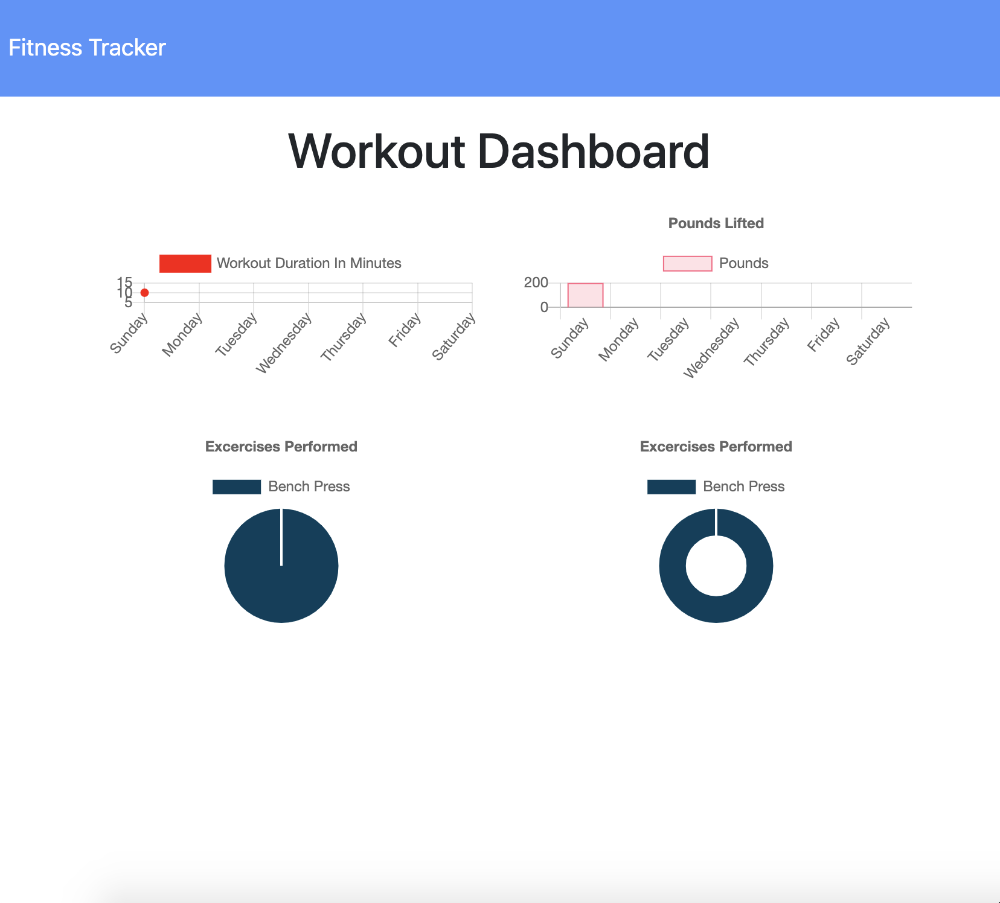
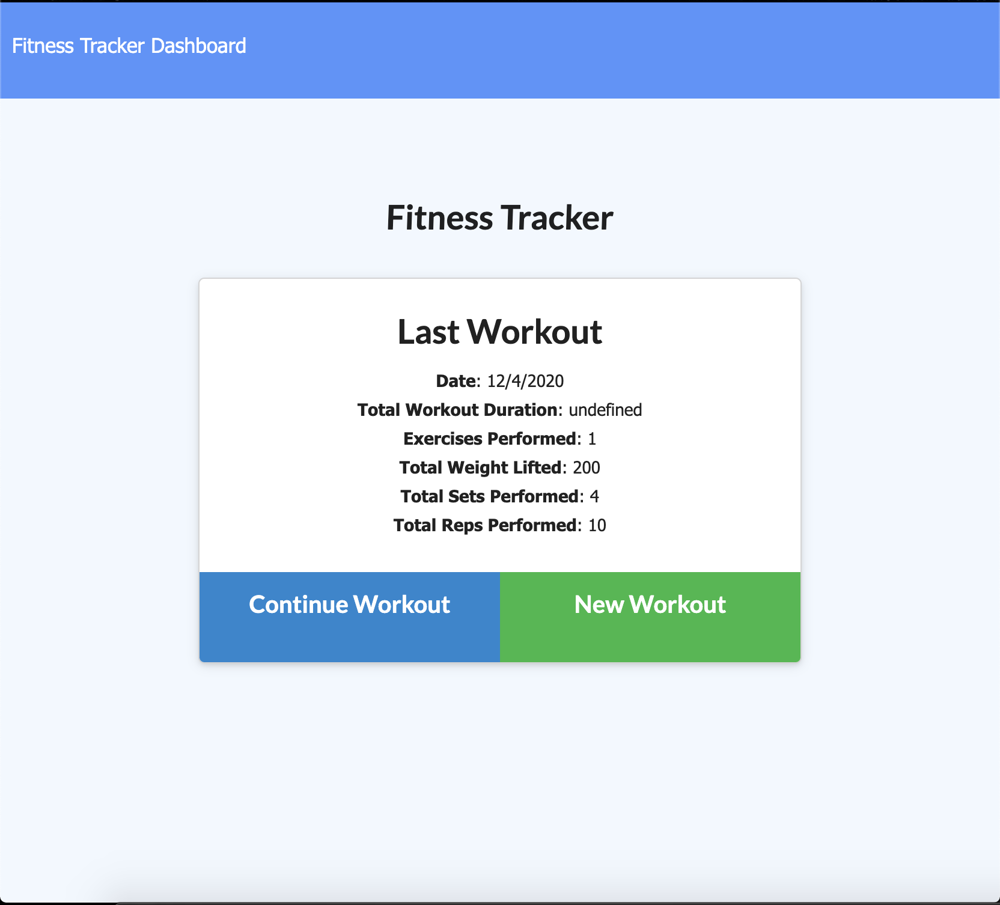

# Workout Tracker

 ## Description
 This project allows a user to view, create, and track daily workouts. They are able to log multiple exercises in a workout on a given day and can also track the name, type, weight, sets, reps, and duration of exercise. They have the option to track distance travelled for cardio exercises.

 This project uses [MongoDB](https://www.mongodb.com/) as a means to store the users data in a database.
  

  ## Link to deployed application

  https://frozen-dusk-39763.herokuapp.com/

  ## Screenshot

  
  